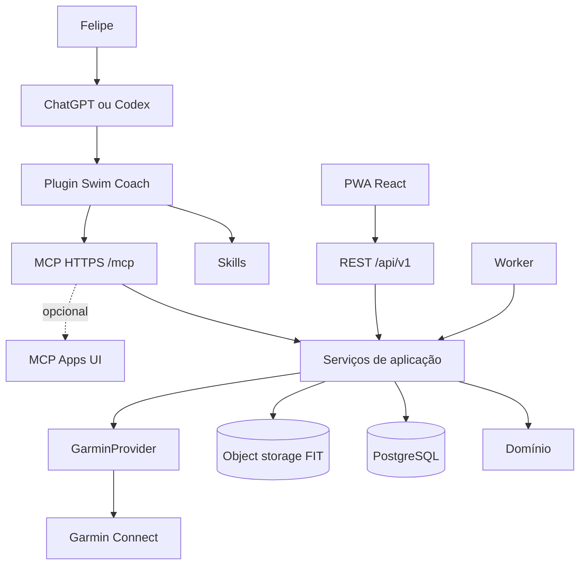

# Plano mestre — Swim Coach Plugin-first

## 1. Resultado final

O produto completo será um treinador pessoal de natação com quatro superfícies coordenadas:

1. **ChatGPT/Codex:** interface conversacional principal, por meio do plugin `swim-coach`.
2. **Garmin Forerunner 265:** execução dos treinos estruturados e captura das atividades.
3. **PWA:** ferramenta auxiliar para calendário, editor, configurações, feedback e contingência.
4. **Backend/MCP:** fonte de verdade, regras determinísticas, integrações, segurança e automações.

O plugin terá:

- Skills versionados para os workflows recorrentes;
- um servidor MCP remoto com ferramentas tipadas;
- nove comandos MCP de intenção, úteis sem UI customizada;
- pacote local/pessoal primeiro;
- preparação para publicação pública futura, sem transformar isso em requisito do MVP.

## 2. Princípios não negociáveis

- **A conversa interpreta; o domínio decide o que é válido.**
- **Ações externas são diretas no contrato v2 e idempotentes/reconciliáveis por baixo.**
- **Toda distância de etapa termina na parede da piscina configurada.**
- **O Garmin fica atrás de uma porta de provider.**
- **O banco, não a conversa, é a memória do produto.**
- **Resultados MCP são úteis mesmo sem UI.**
- **Dados mínimos são enviados ao host; FIT bruto e segredos nunca saem do backend.**
- **A implementação avança por gates verificáveis, não por porcentagem subjetiva.**

## 3. Arquitetura alvo

## 4. Fases e gates

| Fase | Nome | Resultado verificável | Gate para avançar |
|---:|---|---|---|
| P00 | Fundação e spikes | repo executa; MCP inofensivo instalado; riscos Garmin/OAuth validados | todos os spikes com evidência e ADR |
| P01 | Domínio, banco e identidade | perfil, piscina 20 m, meta e infraestrutura transacional persistidos | migrações reversíveis e testes de domínio |
| P02 | Garmin somente leitura | atividades importadas idempotentemente | reexecução sem duplicatas; tokens protegidos |
| P03 | FIT e analytics | atividade normalizada e analisada | fixtures determinísticas e métricas conferidas |
| P04 | Treinos e PWA operacional | treino estruturado criado/editado/agendado localmente | compilação canônica e validação 20 m |
| P05 | MCP somente leitura | ChatGPT consulta contexto e atividade reais | OAuth, escopos, schemas e evals read-only |
| P06 | Skills e pacote do plugin | plugin pessoal instalado com workflows estáveis | matriz de prompts aprovada |
| P07 | Escrita Garmin pela PWA | publicação/agendamento com proposta e aprovação | idempotência, compensação e auditoria |
| P08 | Escrita MCP segura | plugin propõe, confirma e executa ações autorizadas | hash, expiração, scopes e confirmações testados |
| P09 | UI MCP opcional | cartões interoperáveis para revisão/confirmar | ferramentas continuam headless |
| P10 | Planejamento adaptativo | semana proposta a partir de dados e regras | explicabilidade e limites de carga |
| P11 | Automações e resiliência UX | sync, feedback, notificações e offline | jobs recuperáveis e estado coerente |
| P12 | Hardening e release pessoal | backup/restore, segurança, observabilidade e release | checklist operacional completo |
| P13 | ChatGPT-first direto | oito tools, escopo único, PWA auxiliar e Garmin upsert | fluxo completo sem cerimônia técnica visível |
| P14 | Exclusão direta | apagar treino local/agenda/Garmin com uma ação | hard delete idempotente sem apagar atividades |

## 5. Fatias de valor

### Slice A — prova da plataforma

P00: instalar plugin local e chamar `health_check`/`get_capabilities`, sem dados pessoais.

### Slice B — diário real de natação

P01–P03: importar atividade Garmin, guardar FIT e exibir análise na PWA.

### Slice C — conversa com dados reais

P05–P06: perguntar no ChatGPT “como foi minha última natação?” e receber resposta baseada no backend.

### Slice D — ciclo completo de treino

P04, P07 e P08: criar, revisar, publicar no Garmin, nadar, importar e comparar.

### Slice E — treinador adaptativo

P10–P11: propor a próxima semana usando histórico, disponibilidade e feedback.

## 6. Escopo fixo do MVP pessoal

Incluído:

- um único usuário com `user_id` em todas as entidades;
- piscina padrão 20 m;
- meta 2.000 m/45 min;
- natação em piscina;
- leitura e escrita Garmin encapsuladas;
- FIT bruto + normalização;
- PWA responsiva;
- plugin Skills + MCP;
- OAuth 2.1 para acesso remoto a dados privados;
- comandos diretos com revisões/idempotência internas;
- jobs, outbox e auditoria;
- backup e exportação.

Adiado:

- chat próprio na PWA;
- chamadas diretas à OpenAI API;
- múltiplos atletas e cobrança;
- publicação no diretório público;
- corrida/ciclismo/triathlon;
- recomendações médicas;
- ML preditivo;
- Kubernetes e microsserviços.

## 7. Critérios de conclusão do produto pessoal

O plano estará completo quando o gate P14 estiver concluído e for possível demonstrar, sem manipulação manual do banco:

1. instalar o plugin pessoal;
2. autenticar;
3. consultar treino de hoje e últimas atividades;
4. gerar e salvar uma semana;
5. editar ou mover um treino por conversa;
6. publicar/atualizar diretamente no Garmin;
7. sincronizar a atividade realizada;
8. comparar planejado versus executado;
9. registrar RPE/técnica/dor;
10. gerar a semana seguinte com justificativa;
11. recuperar o sistema a partir de backup testado.
12. excluir um treino planejado da agenda, do Swim Coach e do Garmin sem apagar atividades.

## 8. Navegação para implementação

- Regras do agente: [`AGENTS.md`](AGENTS.md)
- Dependências de leitura por fase: [`docs/20-context-map.md`](docs/20-context-map.md)
- Fases: [`phases/`](phases/)
- Prompts prontos: [`prompts/`](prompts/)
- Status: [`IMPLEMENTATION_STATUS.md`](IMPLEMENTATION_STATUS.md)
- Contratos: [`contracts/`](contracts/)
- Matriz de capacidades: [`docs/24-capability-release-matrix.md`](docs/24-capability-release-matrix.md)
- Índice de tasks: [`TASK_INDEX.md`](TASK_INDEX.md)
- Índice de arquivos: [`FILE_INDEX.md`](FILE_INDEX.md)
- Evals do plugin: [`evals/`](evals/)
- Relatório de validação: [`PLAN_VALIDATION_REPORT.md`](PLAN_VALIDATION_REPORT.md)
- ADRs: [`adrs/`](adrs/)
