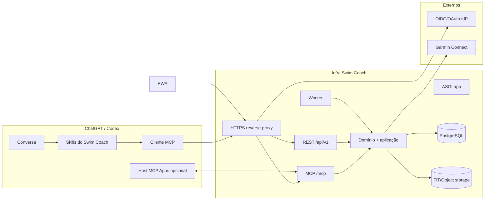
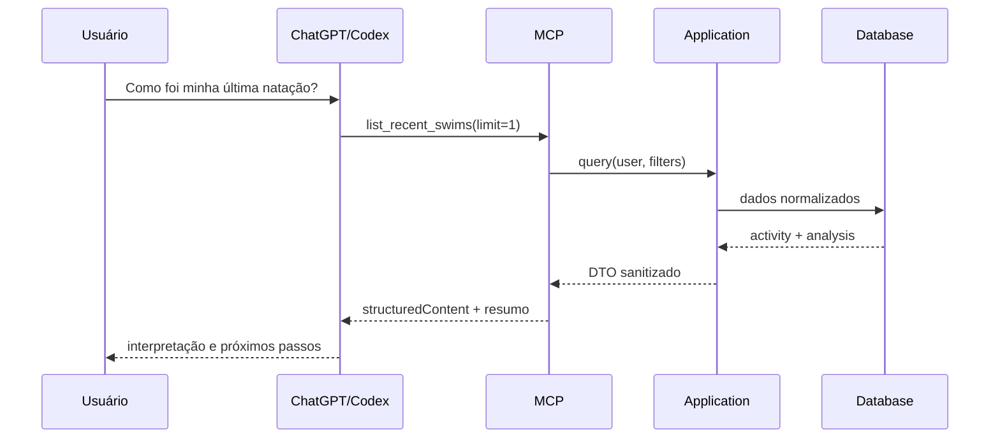
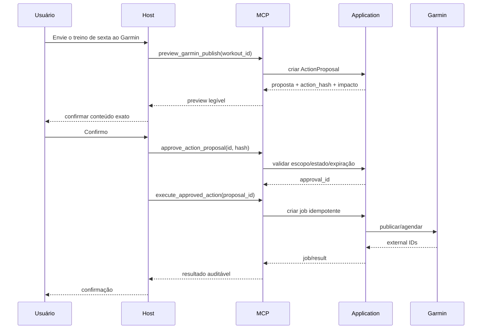

# Arquitetura Plugin-first

## 1. Contexto

A solução precisa combinar uma conversa rica, dados privados, regras determinísticas, integração Garmin instável e ações com efeito externo. O host conversacional não deve ser também a fonte de verdade. A arquitetura separa quatro responsabilidades:

- **host:** conversa, voz, apresentação e seleção de Skill/ferramenta;
- **plugin:** identidade instalável e workflows;
- **MCP/backend:** dados, autorização, validação e ações;
- **PWA:** operação visual e contingência.

## 2. Containers



## 3. Estilo arquitetural

### Monólito modular

Um repositório e um deploy principal para API/MCP, com worker separado usando o mesmo pacote. Módulos possuem limites claros:

- identity;
- athlete;
- goals;
- planning;
- workouts;
- activities;
- analytics;
- garmin;
- actions/approvals;
- plugin/mcp;
- operations.

Não criar importações diretas entre infraestruturas. Casos de uso coordenam portas do domínio.

### Hexagonal pragmática

```text
interfaces (REST/MCP/worker/CLI)
        ↓
application (commands, queries, transactions)
        ↓
domain (entities, value objects, policies)
        ↑
infrastructure (Postgres, Garmin, object storage, OIDC)
```

O domínio não importa FastAPI, MCP SDK, SQLAlchemy nem `garminconnect`.

## 4. Superfícies

### ChatGPT/Codex

Responsabilidades:

- captar objetivo em linguagem natural;
- ativar Skill;
- chamar ferramentas;
- explicar resultado;
- solicitar confirmação explícita;
- renderizar UI MCP quando suportada.

Não é responsável por:

- persistir estado canônico;
- validar treino;
- calcular métricas oficiais;
- guardar credenciais;
- decidir sozinho que uma ação foi autorizada.

### Plugin

O pacote contém:

- `.codex-plugin/plugin.json`;
- `skills/`;
- mapeamento da conexão MCP registrado quando gerado pelo `plugin-creator`;
- assets e metadados opcionais.

O plugin não contém segredos nem credenciais de usuário.

### MCP remoto

- endpoint HTTPS estável, streamable HTTP, normalmente `/mcp`;
- tools focadas, tipadas e versionadas;
- OAuth 2.1 para dados privados e ações;
- outputs headless;
- UI resources opcionais;
- observação/auditoria por tool call.

### PWA

- autenticação OIDC;
- calendário, editor e dashboards;
- fluxo alternativo de aprovação;
- conexão Garmin;
- exportação/exclusão;
- status operacional.

Sem chat próprio no MVP.

## 5. Fluxos principais

### Leitura conversacional



### Escrita com aprovação



## 6. Consistência e transações

- PostgreSQL é a fonte de verdade.
- Uma transação cria estado de negócio + outbox.
- Worker consome `job` com `FOR UPDATE SKIP LOCKED`.
- Efeitos Garmin usam idempotency key interna e verificação de binding externo.
- Retries não criam treino duplicado.
- O estado local nunca é marcado `PUBLISHED` antes de resposta externa persistida.
- Falha após efeito externo exige reconciliação, não novo envio cego.

## 7. Dados e privacidade por superfície

| Dado | PWA | MCP | Host conversacional |
|---|---:|---:|---:|
| perfil mínimo | sim | sim, escopo | somente resultado necessário |
| atividade normalizada | sim | sim, reduzida | sim, por tool result |
| FIT bruto | download autenticado | não | não |
| token Garmin | não exibido | nunca | nunca |
| senha Garmin | bootstrap transitório | nunca | nunca |
| logs de tool call | admin | resumo | não |
| conversa integral | host | não armazenada | host controla |

## 8. Decisões de tecnologia

| Camada | Escolha inicial |
|---|---|
| Backend | Python 3.12+, FastAPI, Pydantic v2 |
| ORM/migração | SQLAlchemy 2 async + Alembic |
| MCP | SDK Python oficial `mcp` |
| Banco | PostgreSQL 16+ |
| Jobs | tabela PostgreSQL + worker |
| Frontend | React + TypeScript + Vite + TanStack Query/Router + shadcn/ui |
| Object storage | filesystem dev; S3 compatível prod |
| Auth | OIDC para PWA; OAuth 2.1 MCP; Auth0 como default substituível |
| Garmin | `python-garminconnect` atrás de adapter |
| FIT | SDK/parser isolado e fixtures anonimizadas |
| Testes | pytest, Testcontainers, Vitest, Playwright, MCP Inspector/evals |

Versões exatas devem ser fixadas no lockfile na P00 e atualizadas por PRs dedicados.

## 9. Evolução

- UI MCP só depois de ferramentas headless estáveis.
- OpenAI API direta só por ADR e caso de uso que o host não resolva.
- RabbitMQ/Redis só após medição.
- Garmin oficial substitui provider, não domínio.
- Multiusuário exige revisão de isolamento, termos, consentimento e publicação.
