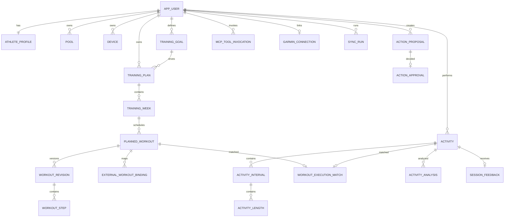

# Modelo de dados

## 1. Fonte de verdade e convenções

O PostgreSQL guarda todo estado canônico. ChatGPT/Codex não são repositório de conversas do produto. O backend persiste fatos de domínio e telemetria sanitizada de ferramentas.

Na P13, comandos novos não criam `ActionProposal`, `ActionApproval` nem
`ActionExecution`. Essas tabelas são legado de transição. Revisões imutáveis,
jobs, audit/outbox e `ExternalWorkoutBinding` continuam ativos. Há um binding
Garmin estável por treino; editar troca sua revisão/hash compilado sem criar um
novo treino externo.

## 2. Diagrama principal



## 3. Convenções de persistência

- IDs internos: UUID v7 quando disponível; UUID padrão como fallback.
- Datas de negócio: `date`.
- Instantes: `timestamptz` em UTC.
- Distâncias: inteiro em metros.
- Durações: inteiro ou decimal em segundos.
- Ritmos: segundos por 100 m.
- Dinheiro/custo: `numeric`, nunca float.
- Payload externo: `jsonb` mais versão do parser.
- Exclusão lógica somente onde houver necessidade de histórico; dados pessoais devem poder ser eliminados fisicamente.
- `created_at`, `updated_at` e `version` para controle otimista quando aplicável.

## 4. Tabelas de domínio e operação

### `app_user`

| Coluna | Tipo | Observação |
|---|---|---|
| `id` | uuid PK | usuário |
| `email` | citext unique | login/allowlist |
| `display_name` | text | Felipe |
| `locale` | text | `pt-BR` |
| `timezone` | text | `America/Sao_Paulo` |
| `status` | text | active/disabled/deleted |
| `last_login_at` | timestamptz | nullable |
| `created_at` | timestamptz | |
| `updated_at` | timestamptz | |

### `auth_identity`

- `id`, `user_id`, `provider`, `subject`, `claims_json`, `created_at`;
- unique `(provider, subject)`.

### `athlete_profile`

- `user_id` PK/FK;
- `experience_level`;
- `preferred_distance_unit`;
- `default_pool_id`;
- `default_sessions_per_week`;
- `goal_notes`;
- `coach_preferences_json`;
- `created_at`, `updated_at`.

### `athlete_constraint`

- `id`, `user_id`, `type`, `severity`, `active_from`, `active_until`, `notes`, `is_active`;
- tipos: injury, pain, schedule, equipment, preference, medical_advice;
- conteúdo nunca deve ser interpretado automaticamente como diagnóstico.

### `pool`

- `id`, `user_id`, `name`, `length_m`, `is_default`, `location_label`, `active`;
- check `length_m > 0`;
- default inicial: 20.

### `device`

- `id`, `user_id`, `provider`, `external_device_id`, `model`, `name`;
- `serial_hash`, nunca serial aberto se não necessário;
- `is_primary`, `capabilities_json`, `last_seen_at`;
- unique `(provider, external_device_id)`.

### `training_goal`

- `id`, `user_id`, `type`, `title`, `status`, `priority`;
- `target_distance_m`, `target_duration_seconds`, `target_date`;
- `target_pace_seconds_per_100m` derivado e persistido para consulta;
- `baseline_json`, `metadata_json`;
- `created_at`, `updated_at`, `completed_at`.

### `goal_milestone`

- `id`, `goal_id`, `name`, `target_date`, `target_json`, `status`, `result_json`.

### `availability_rule`

- `id`, `user_id`, `day_of_week`, `start_local_time`, `end_local_time`;
- `max_duration_minutes`, `pool_id`, `valid_from`, `valid_until`, `priority`.

### `training_plan`

- `id`, `user_id`, `goal_id`, `name`, `status`;
- `start_date`, `end_date`, `methodology`, `generation_source`;
- `policy_json`, `version`, `activated_at`, `closed_at`;
- somente um plano ativo por usuário e esporte, garantido por índice parcial.

### `training_week`

- `id`, `plan_id`, `week_index`, `start_date`, `end_date`, `phase`;
- `target_distance_m`, `target_duration_seconds`, `target_load`;
- `intensity_distribution_json`, `status`, `summary`;
- unique `(plan_id, week_index)`.

### `workout_template`

- `id`, `owner_user_id nullable`, `name`, `objective`, `tags`;
- `definition_json`, `schema_version`, `is_system`, `active`.

### `planned_workout`

- `id`, `user_id`, `plan_id nullable`, `week_id nullable`, `template_id nullable`;
- `title`, `sport`, `workout_type`, `objective`;
- `scheduled_date`, `scheduled_start_time nullable`, `timezone`;
- `pool_id`, `status`, `source`, `priority`;
- `current_revision_id`, `published_revision_id nullable`;
- `locked`, `cancel_reason`, `created_at`, `updated_at`.

Estados recomendados:

```text
draft → planned → approved → publishing → published → completed
                               ↘ publish_failed
planned/approved/published → skipped | cancelled
```

### `workout_revision`

- `id`, `workout_id`, `revision_number`;
- `definition_json` como snapshot canônico;
- `total_distance_m`, `estimated_active_seconds`, `estimated_total_seconds`;
- `validation_json`, `change_reason`, `created_by_type`, `created_by_id`;
- imutável após criação;
- unique `(workout_id, revision_number)`.

### `workout_step`

Tabela normalizada opcional, útil para consulta e edição:

- `id`, `revision_id`, `parent_step_id nullable`, `node_type`;
- `step_order`, `step_kind`, `repeat_count`;
- `end_condition_type`, `end_condition_value`, `end_condition_unit`;
- `target_type`, `target_json`;
- `stroke_type`, `equipment_type`, `rpe_target`;
- `instruction`, `metadata_json`;
- unique `(revision_id, parent_step_id, step_order)`.

A fonte de verdade de uma revisão pode ser o `definition_json`; a tabela de passos deve ser preenchida na mesma transação e validada por teste de equivalência.

### `external_workout_binding`

- `id`, `user_id`, `workout_id`, `revision_id`, `provider`;
- `external_workout_id`, `external_schedule_id`, `external_device_id`;
- `state`, `payload_hash`, `external_payload_json`;
- `published_at`, `scheduled_for`, `last_synced_at`, `last_error`;
- unique `(provider, external_workout_id)` quando não nulo.

### `garmin_connection`

- `user_id` PK;
- `status`: disconnected, active, degraded, reauth_required, disabled;
- `encrypted_token_bundle`;
- `token_key_version`;
- `provider_library_version`;
- `authenticated_at`, `last_refresh_at`, `last_success_at`;
- `last_error_code`, `last_error_message_redacted`;
- nunca armazenar senha.

### `sync_cursor`

- `id`, `user_id`, `provider`, `entity_type`;
- `cursor_json`, `watermark_at`, `last_success_at`, `overlap_seconds`;
- unique `(user_id, provider, entity_type)`.

### `sync_run`

- `id`, `user_id`, `provider`, `sync_type`, `trigger`;
- `status`, `started_at`, `finished_at`;
- contadores: listed, created, updated, skipped, failed;
- `cursor_before_json`, `cursor_after_json`, `error_json_redacted`.

### `raw_provider_payload`

- `id`, `user_id`, `provider`, `entity_type`, `external_id`;
- `content_type`, `json_payload nullable`, `object_key nullable`;
- `checksum`, `provider_updated_at`, `received_at`;
- unique `(provider, entity_type, external_id, checksum)`.

### `activity`

- `id`, `user_id`, `provider`, `external_activity_id`;
- `name`, `sport`, `subtype`, `start_time_utc`, `timezone`;
- `distance_m`, `elapsed_seconds`, `timer_seconds`, `moving_seconds`;
- `pool_length_m`, `length_count`, `calories`;
- `avg_hr`, `max_hr`, `avg_pace_seconds_per_100m`;
- `avg_stroke_rate`, `avg_strokes_per_length`, `avg_swolf`;
- `source_updated_at`, `normalization_version`, `raw_summary_id`, `raw_fit_id`;
- unique `(provider, external_activity_id)`.

### `activity_interval`

- `id`, `activity_id`, `interval_index`, `interval_type`;
- `start_offset_seconds`, `duration_seconds`, `rest_seconds`, `distance_m`;
- `pace_seconds_per_100m`, `avg_hr`, `max_hr`;
- `stroke_type`, `stroke_count`, `stroke_rate`, `swolf`;
- `source_json` para campos não normalizados.

### `activity_length`

- `id`, `activity_interval_id`, `length_index`, `distance_m`, `duration_seconds`;
- `stroke_type`, `stroke_count`, `stroke_rate`, `swolf`, `avg_hr`;
- unique `(activity_interval_id, length_index)`.

### `workout_execution_match`

- `id`, `planned_workout_id`, `activity_id`;
- `method`: automatic, manual, imported;
- `confidence`, `score_details_json`, `confirmed_at`, `confirmed_by`;
- unique `planned_workout_id` e unique `activity_id` no caso comum.

### `activity_analysis`

- `id`, `activity_id`, `planned_workout_id nullable`;
- `algorithm_version`, `metrics_json`, `flags_json`, `summary_json`;
- `created_at`;
- unique `(activity_id, algorithm_version, planned_workout_id)`.

### `session_feedback`

- `id`, `user_id`, `activity_id nullable`, `planned_workout_id nullable`;
- `rpe`, `technique_rating`, `fatigue_rating`, `enjoyment_rating`;
- `pain_present`, `pain_location`, `pain_intensity`, `comment`;
- `created_at`, `updated_at`;
- ao menos atividade ou treino deve ser informado.

### `readiness_snapshot`

- `id`, `user_id`, `snapshot_date`, `source`;
- `sleep_score`, `sleep_hours`, `resting_hr`, `hrv`, `stress`, `body_battery`;
- `soreness`, `motivation`, `manual_fatigue`, `computed_score`;
- `completeness`, `raw_json`;
- unique `(user_id, snapshot_date, source)`.

### `daily_training_metric`

- `user_id`, `metric_date`, `swim_distance_m`, `swim_duration_seconds`;
- `srpe_load`, `high_intensity_distance_m`, `session_count`;
- `algorithm_version`, `metrics_json`;
- PK `(user_id, metric_date, algorithm_version)`.

### `weekly_training_metric`

- `user_id`, `week_start`, `distance_m`, `duration_seconds`, `srpe_load`;
- `completion_rate`, `consistency_metrics_json`, `algorithm_version`.

### `notification`

- `id`, `user_id`, `type`, `channel`, `status`;
- `scheduled_at`, `sent_at`, `payload_json`, `provider_message_id`, `last_error`.

### `job`

- `id`, `user_id nullable`, `job_type`, `payload_json`;
- `status`, `priority`, `available_at`, `attempts`, `max_attempts`;
- `idempotency_key`, `locked_by`, `locked_at`, `heartbeat_at`;
- `last_error_json_redacted`, `created_at`, `finished_at`;
- unique `idempotency_key` quando não nula.

### `outbox_event`

- `id`, `aggregate_type`, `aggregate_id`, `event_type`, `payload_json`;
- `occurred_at`, `published_at`, `attempts`, `last_error`.

### `audit_event`

- `id`, `user_id nullable`, `actor_type`, `actor_id`;
- `action`, `entity_type`, `entity_id`;
- `before_json_redacted`, `after_json_redacted`;
- `correlation_id`, `ip_hash`, `user_agent_summary`, `created_at`.

### `api_idempotency_record`

- `scope`, `idempotency_key`, `request_hash`, `response_status`, `response_json`;
- `created_at`, `expires_at`;
- PK `(scope, idempotency_key)`.

### `data_export`

- `id`, `user_id`, `status`, `object_key`, `expires_at`, `created_at`, `finished_at`.

### `deletion_request`

- `id`, `user_id`, `status`, `requested_at`, `confirmed_at`, `completed_at`;
- `steps_json` para acompanhar revogação Garmin, remoção de dados e objetos.

## 5. Índices principais

- `activity(user_id, start_time_utc desc)`;
- `activity(provider, external_activity_id)` unique;
- `planned_workout(user_id, scheduled_date, status)`;
- `training_week(plan_id, start_date)`;
- `job(status, available_at, priority desc)` parcial para pendentes;
- `outbox_event(published_at, occurred_at)` parcial para não publicados;
- `audit_event(user_id, created_at desc)`;
- GIN em campos JSON apenas quando uma consulta real justificar.

## 6. Política de versionamento

- `WorkoutRevision` é imutável.
- `ActivityAnalysis` mantém múltiplas versões de algoritmo.
- Payload bruto é preservado para reprocessamento.
- Alterações de perfil e feedback relevantes geram auditoria.
- A versão do schema canônico acompanha o JSON de treino.

---


## 7. Tabelas Plugin-first adicionais

### `plugin_release`

- `id uuid PK`;
- `plugin_name text`;
- `version text`;
- `manifest_hash text`;
- `skills_hash text`;
- `compatibility_json jsonb`;
- `released_at timestamptz`;
- unique `(plugin_name, version)`.

### `skill_release`

- `id`, `plugin_release_id`, `skill_name`, `version`, `content_hash`;
- `trigger_description`, `required_tools_json`, `created_at`;
- unique `(plugin_release_id, skill_name)`.

### `plugin_installation`

- `id`, `user_id`, `plugin_release_id`;
- `host_type`, `connection_external_id_hash`, `status`;
- `installed_at`, `last_seen_at`, `revoked_at`;
- não armazenar token nem conversa.

### `mcp_principal`

- `id`, `user_id`, `issuer`, `subject`, `audience`;
- `scopes text[]`, `token_jti_hash`, `first_seen_at`, `last_seen_at`;
- unique `(issuer, subject, audience)`;
- tokens não são persistidos.

### `mcp_tool_invocation`

- implementação P08: `id`, `user_id`, `tool_name`, `request_id`;
- `correlation_id`, `causation_id`, `args_hash`, `outcome`;
- `error_code`, `latency_ms`, `created_at`;
- `causation_id` referencia semanticamente a proposal, job, workout ou activity
  relevante sem FK polimórfica; referências específicas continuam no resultado
  estruturado, audit/outbox e payload sanitizado do job;
- `created_at`;
- retenção limitada; sem argumentos completos por padrão.

Índices:

- `(user_id, created_at desc)`;
- `(tool_name, created_at desc)`;
- `(correlation_id)`;
- `(causation_id)`;
- parcial em `result_status = 'ERROR'`.

### `action_proposal`

- `id`, `user_id`, `proposal_type`, `status`;
- `subject_type`, `subject_id`;
- `payload_json`, `impact_json`, `action_hash`;
- `required_scopes text[]`;
- `created_by_type`, `created_by_id`;
- `expires_at`, `created_at`, `updated_at`, `version`;
- unique opcional `(user_id, action_hash)` enquanto ativa.

### `action_approval`

- `id`, `proposal_id`, `user_id`, `principal_id`;
- `decision`, `approved_action_hash`, `approved_scopes text[]`;
- `channel`, `reason`, `decided_at`;
- unique ativo por proposta/decisão.

### `approval_challenge`

- `id`, `proposal_id`, `challenge_hash`, `channel`;
- `expires_at`, `consumed_at`, `attempt_count`;
- opcional; nunca guardar challenge em claro.

### `action_execution`

- `id`, `proposal_id`, `approval_id`, `job_id`;
- `attempt`, `status`, `idempotency_key`, `external_reference_json`;
- `started_at`, `completed_at`, `error_code`, `reconciliation_required`;
- unique `(proposal_id, attempt)` e `(idempotency_key)`.

### `training_rule_set`

- `id`, `name`, `version`, `rules_json`, `schema_version`;
- `effective_from`, `effective_until`, `content_hash`, `created_at`;
- imutável após uso.

### `planning_run`

- `id`, `user_id`, `goal_id`, `rule_set_id`;
- `input_snapshot_json`, `input_hash`, `output_proposal_id`;
- `status`, `warnings_json`, `created_at`, `completed_at`;
- mesmos inputs/regra devem permitir reproduzir o resultado.

### `training_decision`

- `id`, `user_id`, `decision_type`, `effective_date`;
- `subject_type`, `subject_id`, `evidence_refs_json`;
- `rationale`, `actor_type`, `actor_id`, `created_at`;
- guarda decisão estruturada; não copia conversa.

### `mcp_ui_session` (P09, opcional)

- `id`, `user_id`, `principal_id`, `resource_uri`, `tool_invocation_id`;
- `state_hash`, `expires_at`, `created_at`;
- sem dados que já estejam no domínio.

## 8. Tabelas deliberadamente fora do modelo inicial

Não criar no MVP inicial:

- `coach_conversation`;
- `coach_message`;
- `coach_run`;
- `ai_usage_record`;
- `conversation_summary`.

## 9. Regras de isolamento

- toda query de entidade pessoal inclui `user_id` derivado do principal autenticado;
- `user_id` de input externo é ignorado ou proibido;
- FK composta/checagem de ownership em serviços de aplicação;
- testes de autorização cruzada, mesmo no modo single-user;
- dados brutos ficam separados de DTOs MCP.

## 10. Retenção sugerida

| Dado | Retenção inicial |
|---|---|
| domínio de treino/atividade | enquanto a conta existir |
| FIT bruto | enquanto necessário; configurável |
| tool invocation | 90 dias |
| audit event | 1 ano ou até exclusão |
| job concluído | 30–90 dias |
| raw JSON redundante | 90 dias após normalização, salvo debug opt-in |
| approval challenge | apagar/anonimizar após expiração |

## 11. Migrações

- uma migração por mudança coerente;
- migrations não dependem de integração externa;
- dados default de Felipe são seed explícito de desenvolvimento, não migration global;
- enum de banco somente quando estabilidade justificar; preferir check constraints + catálogo;
- qualquer mudança de unidade ou significado exige backfill, versão e teste de rollback.
