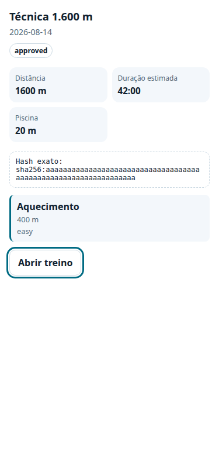

# P09 — optional MCP Apps UI evidence

State: local implementation and automated host gate complete; real ChatGPT host
smoke pending.

Publication: commit `48729a9`, draft PR #10, based on
`p08-mcp-controlled-write`.

## Implemented

- `SWIM_COACH_MCP_UI_ENABLED` is independent and fail-closed: OAuth and the P08
  write surface must both be enabled before any P09 resource/tool is registered;
- five versioned `ui://` resources use `text/html;profile=mcp-app`, a closed CSP,
  no network fetch and only the configured PWA origin for outbound navigation;
- five read-only render tools cover workout/today-or-week, activity comparison,
  goal progress, persisted proposal confirmation and sync/job status;
- data/action tools stay UI-free. Turning the flag off restores the exact P08
  tool list and leaves every workflow complete through structured text;
- the self-contained template uses MCP Apps `ui/*` notifications and
  `tools/call`; `window.openai.openExternal` is only a capability-detected
  navigation enhancement;
- proposal actions submit the exact server-projected proposal ID/hash and only
  call `approve_action_proposal`. Execution is never invoked by the card;
- invalid/expired proposals fail closed, retry appears only from server-declared
  retryability, and a synchronous busy lock prevents double submission;
- the card uses text nodes instead of dynamic HTML, includes live regions,
  keyboard focus, visible units, 44 px controls and a narrow responsive layout.

## Automated evidence

- `make check` passed: Ruff/format, mypy on 88 source files, 106 Python tests,
  2 Vitest tests and both repository validators;
- contract/unit tests cover resource URI/MIME/CSP, schemas, read-only annotations,
  optional registration, exact P08 headless parity, flag dependencies and expiry;
- Playwright bridge-host tests in Chrome at 375×812 cover accessible workout
  rendering, no horizontal overflow, exact-hash approval, double-click and
  expired proposal behavior;
- the approval bridge test records exactly one `approve_action_proposal` call and
  zero `execute_approved_action` calls;
- MCP write PostgreSQL integration exercises real server projection from persisted
  data and verifies the approval boundary; this is database integration, not a
  ChatGPT host claim.
- `make dependency-scan` found no known Python or pnpm vulnerabilities;
- `make secret-scan` scanned 24 commits and the final directory with no leaks;
- `make build` completed the Vite and four Compose images; a separate wheel
  inspection confirmed both `ui.py` and the versioned HTML asset are packaged.
- the rebuilt API image loaded the packaged HTML at runtime (11,481 bytes).

Sanitized bridge-host screenshot:

## Platform design evidence

The standards-first shape was checked on 2026-08-12 against OpenAI's official
[MCP Apps UI guide](https://developers.openai.com/plugins/build/chatgpt-ui) and
[plugin UI reference](https://developers.openai.com/plugins/reference). The
implementation follows their current resource MIME type, `_meta.ui.resourceUri`,
bridge and CSP guidance while retaining legacy metadata only as a compatibility
alias.

## Evidence boundary

The Playwright page is a deterministic bridge mock and contains sanitized fixture
data. It proves the component protocol and behavior but does not prove rendering
inside ChatGPT. The user-provided P00 screenshot proves the MCP connection, not
the P09 card surface.

## Pending real gate

1. start the OAuth/write/UI-enabled server and tunnel;
2. refresh the connector and open a new ChatGPT conversation;
3. render workout, activity, goal and sync cards with owned data;
4. create a disposable proposal and render its confirmation card;
5. approve or reject the exact hash, confirm no execution occurred from the card;
6. disable UI and repeat the workflow headlessly;
7. retain only sanitized screenshots/transcript, with no token, credential, FIT
   payload or provider identifier.

Until this host smoke passes, P09 remains `IN_PROGRESS`.
