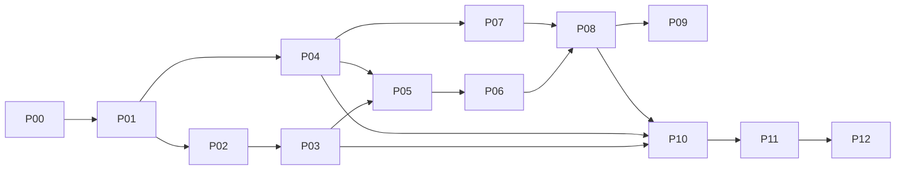

# Fases de implementação

Cada arquivo é uma unidade de execução. Uma fase pode ocupar vários commits/PRs, mas não deve misturar critérios de fases posteriores.

## Fluxo

1. validar dependências no status;
2. marcar fase `IN_PROGRESS`;
3. executar tasks em ordem de risco/dependência;
4. cumprir testes e evidências;
5. atualizar contratos/ADRs quando necessário;
6. marcar `DONE` somente após gate;
7. produzir handoff.

## Dependências

P09 é opcional para o produto pessoal, mas deve ser explicitamente `SKIPPED` por ADR se não for implementada.
